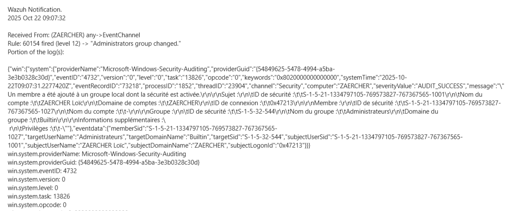
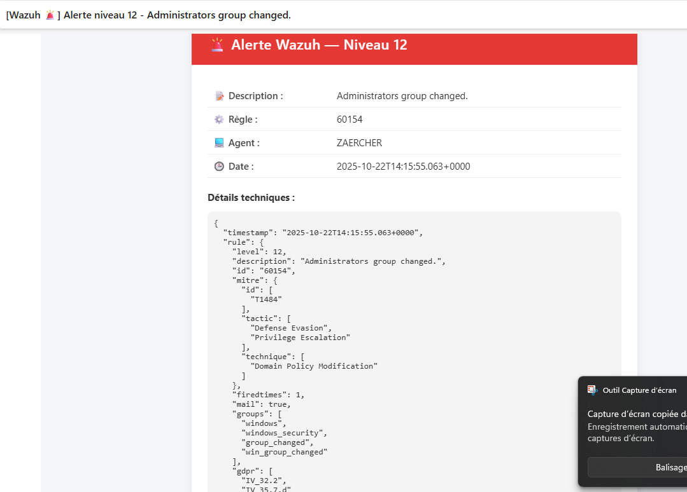

# Deploy Wazuh Docker in single node configuration

Ici, nous allons utiliser Docker avec `docker-compose.yml` pour simuler l'indexer, le dashboard et le manager. Je rajouterai ensuite le système smtp pour tester.

Dans le répertoire du fichier :

```
$ docker-compose up -d
```


# Configuration de la personnalisation de l'email

Voilà à quoi ressemble un mail d'alerte de niveau 12 : 



Grâce au script, on a les informations les plus importantes et une présentation plus clair. 


(voir documentation : documentation/configuration_email.md )

Petite update au niveau du style de la page 

