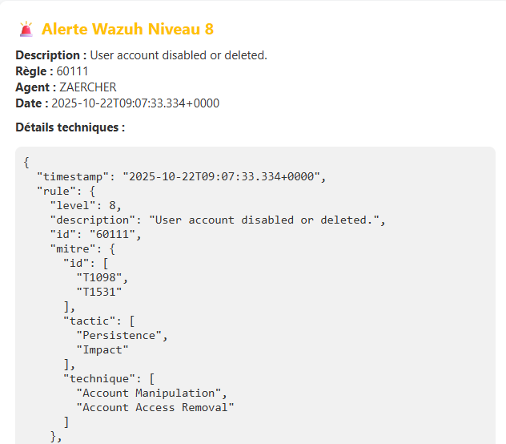

# Deploy Wazuh Docker in single node configuration

Ici, nous allons utiliser Docker avec `docker-compose.yml` pour simuler l'indexer, le dashboard et le manager. Je rajouterai ensuite le système smtp pour tester.

Dans le répertoire du fichier :

```
$ docker-compose up -d
```


# Configuration de la personnalisation de l'email (voir dans les fichiers de conf "configuration_email.txt")
